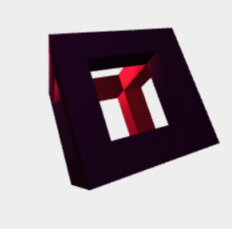

# IF3260_Tugas2_K03_G13

<table>
    <tr>
        <td colspan = 3 align = "center">
            KELOMPOK 13 - K03
        </td>
    </tr>
    <tr>
        <td align="center">No</td>
        <td align="center">Nama</td>
        <td align="center">NIM</td>
    </tr>
    <tr>
        <td align="center">1</td>
        <td align="">Nicholas Budiono</td>
        <td align="center">13520121</td>
    </tr>
    <tr>
        <td align="center">2</td>
        <td align="">Steven</td>
        <td align="center">13520131</td>
    </tr>
    <tr>
        <td align="center">3</td>
        <td align="">Atabik Muhammad Azfa Shofi</td>
        <td align="center">13520159</td>
    </tr>
</table>

## 3D WebGL Hollow Object

### Table of contents
* [Overview](#overview)
* [Showcase](#showcase)
* [How to Run](#how-to-run)
* [Checklist dan Pembagian Tugas](#checklist-dan-pembagian-tugas)

### Overview

### Showcase

### How to Run
1. Buka folder src
2. Jalankan `index.html`

### Checklist dan Pembagian Tugas
<table>
    <tr>
        <td colspan = 3 align = "center">
            <strong>Fitur Wajib</strong>
        </td>
    </tr>
    <tr>
        <td align="center">Spesifikasi</td>
        <td align="center">Terselesaikan</td>
        <td width="30%" align="center">Oleh</td>
    </tr>
    <tr>
        <td align="center">Dapat membuka sebuah file model hasil penyimpanan</td>
        <td align="center"><strong>✓</strong></td>
        <td align="center">13520131 - Steven</td>
    </tr>
    <tr>
        <td align="center">Membuat proyeksi orthographic</td>
        <td align="center"><strong>✓</strong></td>
        <td align="center">13520131 - Steven</td>
    </tr>
    <tr>
        <td align="center">Membuat proyeksi oblique</td>
        <td align="center"><strong>✓</strong></td>
        <td align="center">13520131 - Steven</td>
    </tr>
    <tr>
        <td align="center">Membuat proyeksi perspective</td>
        <td align="center"><strong>✓</strong></td>
        <td align="center">13520131 - Steven</td>
    </tr>
    <tr>
        <td align="center">Mengimplementasikan rotasi</td>
        <td align="center"><strong>✓</strong></td>
        <td align="center">13520131 - Steven</td>
    </tr>
    <tr>
        <td align="center">Mengimplementasikan translasi</td>
        <td align="center"><strong>✓</strong></td>
        <td align="center">13520159 - Atabik</td>
    </tr>
    <tr>
        <td align="center">Mengimplementasikan scaling</td>
        <td align="center"><strong>✓</strong></td>
        <td align="center">13520131 - Steven</td>
    </tr>
    <tr>
        <td align="center">Mengimplementasikan camera</td>
        <td align="center"><strong>✓</strong></td>
        <td align="center">13520121 - Nicholas</td>
    </tr>
    <tr>
        <td align="center">Mengimplementasikan reset</td>
        <td align="center"><strong>✓</strong></td>
        <td align="center">13520159 - Atabik</td>
    </tr>
    <tr>
        <td align="center">Mengimplementasikan shading</td>
        <td align="center"><strong>✓</strong></td>
        <td align="center">13520131 - Steven</td>
    </tr>
    <tr>
        <td align="center">Mengimplementasikan help</td>
        <td align="center"><strong>✓</strong></td>
        <td align="center">13520159 - Atabik</td>
    </tr>
    <tr>
        <td colspan = 3 align = "center">
            <strong>Fitur Lanjutan</strong>
        </td>
    </tr>
    <tr>
        <td align="center">Bonus - 9  Animasi yang dapat diaplikasikan pada setiap model yang di load</td>
        <td align="center"><strong>✓</strong></td>
        <td align="center">13520131 - Steven</td>
    </tr>
    <tr>
        <td align="center">Bonus - 10  Implementasi shading manual tanpa fungsi bawaan GL (membandingkan bagaimana efek warna sinar terhadap warna suatu bidang, dengan mempertimbangkan sudut yang dibentuk garis normal bidang terhadap sudut datang sinar)</td>
        <td align="center"><strong>✓</strong></td>
        <td align="center">13520131 - Steven</td>
    </tr>
    <tr>
        <td align="center">Bonus - 11 Shading dapat diganti warna dan arah sinarnya, atau dari titik suber cahaya secara spesifik, bukan dari point of infinity</td>
        <td align="center"><strong>✓</strong></td>
        <td align="center">13520131 - Steven</td>
    </tr>
    <tr>
        <td colspan = 3 align = "center">
            <strong>Hollow Objects</strong>
        </td>
    </tr>
    <tr>
        <td align="center">
            
        </td>
        <td align="center"><strong>✓</strong></td>
        <td align="center">13520121 - Nicholas</td>
    </tr>
    <tr>
        <td align="center">
            
        </td>
        <td align="center"><strong>✓</strong></td>
        <td align="center">13520131 - Steven</td>
    </tr>
    <tr>
        <td align="center">
            -
        </td>
        <td align="center"><strong>✗</strong></td>
        <td align="center">13520159 - Atabik</td>
    </tr>
</table>