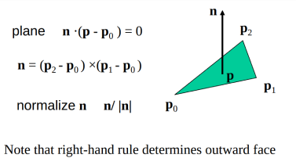
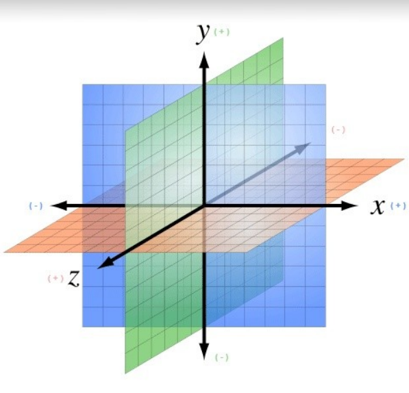
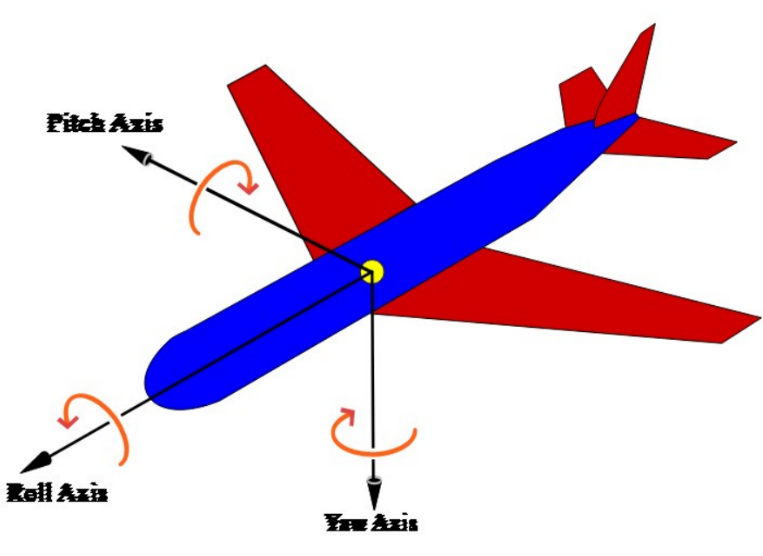
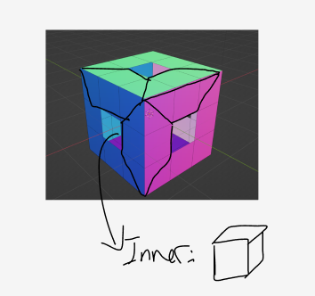
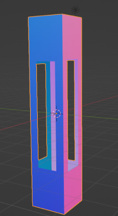
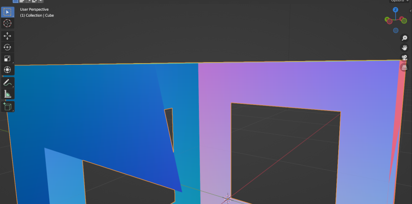

# Hal yang Perlu Diperhatikan

## Rule Penggambaran

## Koordinat

## Rotasi
  
Pitch Axis = x 
Yaw Axis = y 
Roll Axis = z 

## Ide Vertex Kubus

## Acuan Hasil Scale dari Blender
Sisinya yang satu arah dengan scale axisnya juga ikut terscale 

## Acuan Camera Clip Effect
Model yang terpotong ketika discale bukanlah bug melainkan sebuah camera clip effect. Pada blender juga bisa terjadi seperti ini  
